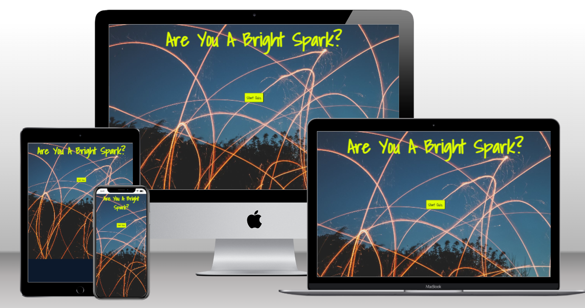
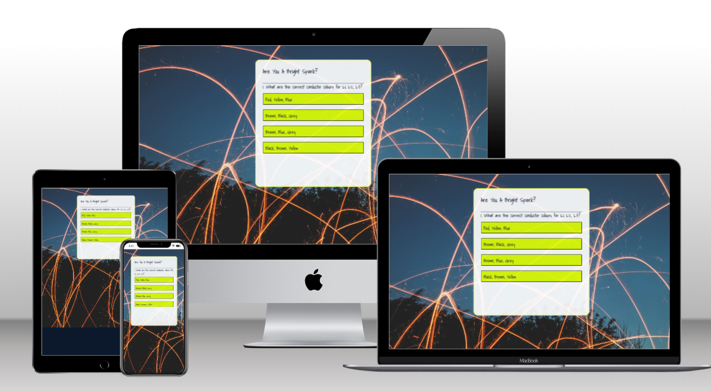

# Bright Spark

Welcome to Bright Spark. This is a website that focusses on electrical questions in the form of a mini quiz to refresh knowledge for trained electricians or apprentices.

The users of this website will take part in a mini quiz to test their knowledge of electrical regulations, with a score baing displayed at the end to give feedback on how many correct answers were achieved.

## Live Website

[Appreciate IPA](https://daniel009891.github.io/appreciate-ipa/index.html)

## Repository

[Repository Link](https://github.com/Daniel009891/appreciate-ipa)

## UX: User Experience

### User Stories

As a user,

* I would like the website to be visually appealing and give me an understanding of IPA.
* I would like to be able to navigate easily through the website.
* I would like to understand what IPA is and its history.
* I would like to be able to learn more about IPA and the different types.
* I would like to find out about future events on the website.
* I would like to be able to ask questions or provide feedback.

### Initial Concept

The initial concept was to create a website that would both inform existing fans of IPA and help new people understand the history, popularity and types of IPA. As well as keep members updated on all craft beer related news through the medium of a newsletter.

### Website Structure

Appreciate IPA consists of three HTML pages. The layout of the website is simple and consistent. A navigation bar at the top makes switching through the pages easy and effortless.

The main page is the default landing page, the second and third pages are easily accessible by clicking on the links in the navigation bar. Each page is broken up so that relevant information for that page is easily found.

In addition to the navigation bar, The logo is linked to the top of the each page to redirect the user back to the home page.

The website is fully responsive to different screen sizes and the layout adapts and changes as the screen sizes decrease. This was found to be the best option to keep a clear and concise website. Iframes and images change size as the screen sizes get smaller, so as to not disform the layout. The hero image spans the full length of the webpage and changes with the relevant screen sizes.

### Imagery

The images have been chosen to highlight craft beer and IPA, to show a sense of culture and fun. The images are integral to the website as they give meaning to the topic at hand.

Detailed alt attribute are included for each image to describe the image for the ease of screen readers. The intention for this is to improve accessibility so that the images will deliver the same effect for all users.

### Colour Scheme

The colour scheme for the website is minimilistic to enable all users to read the text without any posibility of clashing with backgrounds. A light grey background has been used on the home page, this has also been used on the footer element. The classic grey colour is contemporary and is regularly used with similar websites of this nature.

The background colour for the homepage is light Grey rgba(211, 211, 211, 0.493) with transparency applied. This allows the colour to remain subtle and not create a negative contrast. The colour of texts for the main contents is black to ensure sufficient contrast for accessibility. The navigation bar has a background colour of white #FFFFFF with contrasting font in Black. Black is used for the social media icons in the footer, and slate Grey #708090 is used for dividing borders within the website.

### Typography

There is only one font used in the website and it is imported from [Google Fonts](https://fonts.google.com/). Lato was picked due to its contemporary feel, this compliments the topic beautifully as IPA is seen as a more modern contempoarary topic.

## Features

### Existing Features

#### Navigation Bar

Featured on all three HTML pages, the fully responsive navigation bar includes the logo which links back to the main page. There are also 3 individual navigation links (Home, Contact, Free Beer). This allows the user to easily navigate to their desired page without having to use the "back" button each time.

#### Navigation bar for screen sizes <350px

At 350px the text in the nav will change colour to light grey, this is due to the hero image changing. The light grey provides a better contrast for this background. When hovering over the navigation links, the text displays an underline and the cursor turns to a finger point, this enables the user to tell which link they are hovering over, and indicates that it is a button. When a link is pressed, the underline will stay permenantly on so as to show which page the user is currently looking at.

#### Navigation bar for screen sizes >950px

When hovered over, the text displays an underline to show it is a button. When clicked the underline will be permenant, denoting which page the user is currently on.

#### The hero Image

All three pages includes a hero image of a selection of IPAs, this has been chosen to engage with the user as its relevant to the nature of the website. The hero image changes with the media queries to enable a smoother resonse.

##### Greater than 1200px

##### Less than 1200px

##### less than 350px

### Home page

#### About us

This section provides a brief description about the website and its volunteers.

#### IPA.. whats all the fuss about?

This section includes an imbedded video which describes what IPA is, the history behind it and the various types of IPA.

### Contact page

The contact page includes a section detailing contact information if the user requires any further info on the topic of IPA. There is also opening times for the office listed so the user will not be dissapointed by ringing and not getting an answer. A heading is provided to give information on the annual IPA festival and how to book tickets.

##### Contact details

A second section provides the user with the location and date of the annual IPA festival.

##### IPA festival details

#### Form page

The form page is made up of three fieldsets designed to collect useful data from the user. The user will also be signed up to a monthly newsletter once the form is submitted. The form has required elements in all three fieldsets to ensure blank or half filled forms cannot be submitted. Name and email text inputs have been added to the first fieldset with an age dropdown menu showing six age ranges.

The second fieldset is made up of 9 radio buttons which work as intended, the user will only be able to select one option.

The third fieldset is a text area for the user to give feedback on where they heard about the website. Having a competition linked to the completion of the form will encourage more users to fill in their details and submit, these details can be used for marketing purposes in the future.

At the end of the form there are two buttons, submit and reset form. When hovered over the text changes colour from white to black to indicate it is a button. The submit button send the data off if all fields are filled out correctly. The reset button allows the user to clear the whole form, in case of any mistakes.

#### Footer

The footer section includes links to the social media sites, the links open in a new tab to allow easy navigation for the user. The footer is available on all three HTML pages.

### Features Left to Implement

* The navigation bar is currently still three seperate links when the screen size is below 350px. I would like to add a hamburger drop down menu to fit the screen better and give a positive experience at this resolution.

* I would like to incorporate a chatbot popup to give FAQs and standard answers for the user.Once ive learned Python hopefully i can achieve this.

## Technologies Used

* The website was created with [HTML](https://html.spec.whatwg.org/).
* [CSS](https://www.w3.org/Style/CSS/Overview.en.html) was used to add styling to the website.
* [Codeanywhere](https://codeanywhere.com/) was used to create, edit and preview the codes.
* [Git](https://git-scm.com/) was used for version control and tracked changes in the codes.
* [GitHub](https://github.com/) was used to store the codes and deploy the website.
* [Chrome Dev Tools](https://developer.chrome.com/docs/devtools/) were used extensively while adjusting the objects in the website for different screen sizes.
* The website was fully validated using [W3C HTML Validator](https://validator.w3.org/) and [W3C CSS Validator](https://jigsaw.w3.org/css-validator/).
* [Am I responsive?](https://ui.dev/amiresponsive) was used to generate the mockup image showing the website on various screen sizes.
* The fonts used in the website are imported from [Google Fonts](https://fonts.google.com/).
* The website uses icons from [Font Awesome](https://fontawesome.com/).
* [Shutterstock](https://www.shutterstock.com/) was used to source royalty free images.
* The website uses icons from [Font Awesome](https://fontawesome.com/).
* [YouTube](https://app.grammarly.com/) was used to embed an informative video withn the website.
* A map was embedded in the website using [Google Maps](https://app.grammarly.com/)

## Testing

### Code Validation

The website was fully validated to ensure there were no syntax errors. The official [W3C HTML Validator](https://validator.w3.org/) and [W3C CSS Validator](https://jigsaw.w3.org/css-validator/) were used for the validation and no errors were found. One warning is showing for all three HTML pages as a section has been used for the hero image without a heading element, this is minor and does not effevt any functionality.

### Lighthouse

The website was tested with Lighthouse in the Dev Tools for performance, accessibility, best practices, and SEO.

##### Results for index.html for desktop

##### Results for index.html for mobile

##### Results for contact.html for desktop

##### Results for contact.html for mobile

##### Results for form.html for desktop

##### Results for form.html for mobile

### Brower Compatibility

Appearance, functionality and responsiveness of the website were tested with the following browsers:

* Google Chrome
* Safari
* Microsoft Edge

As part of this testing, the following were tested and no issues were found:

* All internal links function as expected.
* All external links function as expected and they open in new tabs.
* All features function as expected.
* The form inputs validated - empty fields are not allowed and only correct email address format is accepted.
* Responsiveness to different screen sizes - images, iframes, font sizes, margins, and overall spacing.

The website was also manually tested on iPhone 12 pro, samsung galaxy tab e and HP pavillion laptop for the above. No issues were found.

### Responsiveness

Responsiveness design tests were executed using [Chrome Dev Tools](https://developer.chrome.com/docs/devtools/) and no issues were found. This included the following devices:

* iPhone 4, SE, XR, 12 Pro, 5/SE, 6/7/8, 6/7/8 Plus and X
* iPad Air and iPad Mini
* Samsung Galaxy S8+, S20 Ultra
* Microsoft Surface Pro 7 and Duo
* Nest Hub and Hub Max

### Resolved Bugs

*A bug was fixed where in google chrome, when the media query was applied to the homepage th e iframe for the video element was creating a white space down the right hand side of the page vertically. It was found to be an issue with the size and padding of the iframe pushing the browser out creating a horizontal scroll bar. I resized the iframe and reduced the padding to stop this happening.

*When testing the layout initially the footer  element was floating in the middle section of the page, I researched how to change this as normall CSS styling didnt help. I found that adding a flex box pushed the fotter into position and lept it at the bottom of the page in its desired location. 

### Unresolved Bug

* There are no known unresolved bugs within the website.

## Deployment

The website has been deployed to GitHub pages.
The live link can be found here - [Appreciate IPA](https://daniel009891.github.io/appreciate-ipa/)

### Deploying a GitHub Repository to GitHub Pages

1. Navigate to the "Settings" tab in the GitHub repository.
2. Select "Pages" from the menu on the left.
3. Under the "Source" section, select "Deploy from a branch" and "Branch: main." Click on "Save."
4. GitHub takes a short while to publish the website. Refresh the page, if not done automatically, and once the website is deployed, the URL will be displayed.  

### Forking the GitHub Repository

To make a copy or "fork" the original repository to view or make changes without affecting the original repository,

1. Log into GitHub and locate the repository.
2. Select the "Fork" option at the top of the screen to create a copy of the repository.
3. This will create a copy of the repository in your GitHub account.

### Creating a Local Clone

1. In the GitHub repository, select the "Code" button.
2. In the "Clone" box, under the "HTTPS" tab, click on the clipboard icon to copy the URL.
3. In Gitpod, change the current working directory to the location you would like the cloned directory to be created.
4. Type "git clone" and then paste the URL copied from GitHub.
5. Press "Enter" and the local clone will be created.

## Credits

### Contents

### Media

* Images used were sourced from [shutterstock.com](https://www.shutterstock.com/).
* Video for about IPA was sourced from [youtube.com](https://www.youtube.com/).
* The map used on the contact page was sourced from [Google Maps](https://app.grammarly.com/).

### Codes

* The nav element and media query sizes were inspired by the[Love Running](https://github.com/Daniel009891/love-running) project.
* The flex box was inspired by [Kiranworkspace.com](https://kiranworkspace.com/how-to-stick-footer-to-bottom-of-page/) to aid with the footer position.

## Acknowledgements

This website was created as a portfolio 1 project for the Full Stack Software Development course at [Code Institute](https://codeinstitute.net/ie/). I would like to thank my mentor, [Harry Dhillon](https://github.com/Harry-Leepz), for the guidance and encouragement given throughout the project. Following his valuable feedback and advice, the website has been refined to be more intuitive and it has improved the overall user experience.

I would also like to thank the slack community at Code institute, the issues with styling and positioning have been rectified mostly by searching the same issues on slack. This has proven an invaluable tool for myself.
